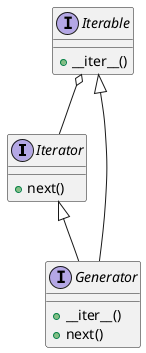

# P204: A list of prime numbers

求指指定區間內所有的質數。比如，給定區間10至20應返回所有大於等10且小於等20的質數`[11, 13, 17, 19]`。照例先寫測試用例：

[include](../../../tests/arithmetic/p204_test.py)

在P201中已經實現了一個檢驗一個整數是否為質數的方法`is_prime`。現在，給定一個整數區問求其中所有的質數。則最簡單的方法就是逐個檢驗區間內所有整數。（檢驗質數的方法請參見P201）。

完整的代碼實現：

[include](../../../python99/arithmetic/p204.py)

代碼中使用了Python的一個特性`yield`。了解`yield`之前要先了解「生成器（generator）」，而要了解生成器則要先了解「可迭代（iterable）」。

## Iterables

「可迭代對象（iterable objects）」是實現了`__iter__()`的對象，`__iter__()`應該返回一個「迭代器（iterator）」對象。
迭代器器是一個實現了`next()`的對象，`next()`應該返回可迭代對象中下一個元素，當沒有更多元素時則抛出異常`StopIteration`。
最簡單的用例就是可迭代對自己實現`next()`然後把自己作為迭代器在`__iter__()`中返回。
可迭代對象可以被用於for循環中，也可以用以構造列表。[^python-wiki-iterator]

## Generator

「生成器（generator）」是「迭代器（iterator）」的一種實現。其實現了`__iter__()`和`next()`。



## Yield expressions

Yield表達式用於定義生成器函數或異步生成器函數（asynchronous generator function），所以其祇能在函數體定義中使用。在函數體中使用yield表達式會使該函數變成一個生成器，在用關鍵詞`async def`定義的函數體中使用則會使協程函數變成異步生成器。[^python-doc-yieldexpr]

本例中，我們使用yield表達式將函數`prime_generator`轉換成一個生成器。生成器與列表及其它有序容器的區別就是：生成器中的元素是在被訪問時才構造的；而列表中的元素則是在定義列表時就構造了。

請看如下代碼，`prime_list`在找出區間內所有的質數並放在列表中返回。執行代碼後就能發現，其先執行`prime_list`中所有代碼（Check 1, Check 2, ..., Check 10），然後再執行`for x in prime_list(1, 10)`循環（Iterate 2, Iterate 3, ..., Iterate 7）。

```python
from python99.arithmetic.p201 import is_prime

def prime_list(lower, upper):
    result = []
    for num in range(lower, upper+1):
        print("Check "+str(num))
        if is_prime(num):
            print("Found prime "+str(num))
            result.append(num)
    return result

for x in prime_list(2,10):
    print("Iterate "+str(x))
```

控制台輸出：

```txt
Check 2
Found prime 2
Check 3
Found prime 3
Check 4
Check 5
Found prime 5
Check 6
Check 7
Found prime 7
Check 8
Check 9
Check 10
Iterate 2
Iterate 3
Iterate 5
Iterate 7
```

再看如下代碼，`prime_generator`使用yield返回質數結果，這使用`prime_generator`變成一個生成器。執行代碼後發現，`prime_generator`不會在`for x in prime_generator(2, 10)`之前就構造所有元素。而是當外部訪問一個元素（調用`next()`）時再生成。比如，當外部要訪問第一個元素時，其逐個檢驗區間內的整數，當找到第一個質數時（Found prime 2）就立馬返回該元素，而不是像`list`一樣構造完所有元素後才返回。

```python
from python99.arithmetic.p201 import is_prime

def prime_generator(lower, upper):
    for num in range(lower, upper+1):
        print("Check "+str(num))
        if is_prime(num):
            print("Found prime "+str(num))
            yield num

for x in prime_generator(2,10):
    print("Iterate "+str(x))
```

控制台輸出：

```txt
Check 2
Found prime 2
Iterate 2
Check 3
Found prime 3
Iterate 3
Check 4
Check 5
Found prime 5
Iterate 5
Check 6
Check 7
Found prime 7
Iterate 7
Check 8
Check 9
Check 10
```

在「祇要求給出一個可行解」的應用中使用生成器可以減少不必要的運算。「在祇要求給出一個可行解」的應用中，不需要枚舉所有值。生成器「按需構造」的特性很適用。

`is_prime`代碼實現：

[include](../../../python99/arithmetic/p201.py)

## 參考文献

[^python-wiki-iterator]: https://wiki.python.org/moin/Iterator
[^python-doc-yieldexpr]: https://docs.python.org/3.7/reference/expressions.html#yieldexpr
